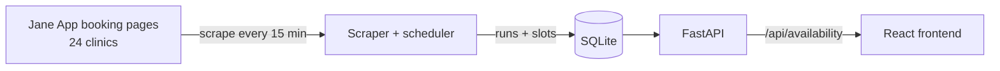

# RMT Finder

Find open RMT (registered massage therapist) appointments across 24 Victoria, BC
clinics in one place — scraped every 15 minutes, shown with honest freshness
labels.

**Live:** https://rmtfinder.studiobeckett.ca

<!-- screenshot: add once the site is live over HTTPS

-->

<!-- NOTE: wording throughout assumes Jane App is the only booking platform.
When a second platform lands (Mindbody adapter is already stubbed in
scraper/clinics.py), update: the pitch line, "How it works" diagram + prose,
and the scraping-posture section (robots.txt argument is Jane-specific). -->

## Why

Booking a massage in Victoria means checking two dozen clinic booking sites by
hand, one at a time, most of which show nothing available. Each clinic runs its
own Jane App booking page, and no aggregate view exists. RMT Finder scrapes the
public booking pages on a schedule and answers the only question that matters:
*who has an opening in the next three days?*

## How it works



A scheduler process runs a scrape cycle every 15 minutes: each clinic's Jane App
page is fetched (with a courtesy delay between clinics), massage-therapy
treatments are matched and filtered, and the resulting slots are written to
SQLite along with a record of the run itself — when it ran, which clinics
succeeded, which failed. A FastAPI service reads the same database and serves
both the JSON API and the built frontend from one origin.

## Design decisions

**Serve the last *good* run, admit the gap.** If the most recent scrape failed
entirely, the API serves the last run that succeeded and reports both
timestamps. The frontend turns that into explicit UI states: a staleness banner
when data is older than two scrape intervals, a quieter notice when some
clinics failed ("2 of 24 clinics couldn't be checked"), and a distinct message
when the latest check failed outright. No state pretends the data is fresher or
more complete than it is.

**One broken clinic can't kill a run.** Each clinic scrape is isolated;
failures are caught, recorded per-clinic in the run history, and the cycle
continues. Clinics change their Jane App configurations without notice, so
partial failure is the normal case to engineer for, not the exception.

**Scraping posture.** Jane App's `robots.txt` explicitly allows general
crawlers on public booking pages (`User-agent: * / Allow: /`). On top of that,
the scraper keeps its footprint small: public pages only, a pause between
clinics, ~one pass per 15 minutes, and a run-history table that would surface
any throttling immediately.

**Duplicates are signal, not noise.** There's deliberately no deduplication
yet: while treatment filtering is still being tuned per-clinic, a duplicate
slot usually means a filtering bug (the same opening matched under two
treatment names). Dedup gets added only once filtering is proven clean —
otherwise it would hide exactly the bugs that need fixing.

**SQLite on purpose.** One writer (the scheduler), one reader (the API), a few
hundred rows per run — a database server would add operational surface without
buying anything. The storage layer is a single module, so outgrowing SQLite is
a contained change.

## Run it locally

Backend (Python 3.11+):

```bash
python -m venv venv && venv/bin/pip install -r requirements.txt
cd backend
../venv/bin/python main.py                      # one scrape cycle → data/rmt-finder.db
../venv/bin/uvicorn api:app --port 8000         # API at localhost:8000
../venv/bin/python scheduler.py                 # or: keep scraping every 15 min
```

Frontend:

```bash
cd frontend
npm install
npm run dev        # localhost:5173, talks to the API at localhost:8000
```

Tests run in CI on every push, or locally with `venv/bin/pytest -q` (46 tests)
and `npm test` in `frontend/` (33 tests).

## Deployment

Runs on a $4/month DigitalOcean droplet: two systemd services (API + scheduler)
sharing the SQLite file, Caddy terminating HTTPS in front of uvicorn, GitHub
Actions running both test suites on every push. Deliberately Docker-free for
v1 — the full reasoning and step-by-step runbook is in
[docs/plans/vertical-slice/07-deployment.md](docs/plans/vertical-slice/07-deployment.md).

## Roadmap

- Nightly SQLite backup off-box
- Dockerize (compose file for the API + scheduler pair)
- Publish each run as a static JSON snapshot to a CDN, decoupling serving
  uptime from the scraper box
- Slot-level dedup, once per-clinic filtering is proven clean
- More cities, more booking platforms (the scraper is adapter-based)
