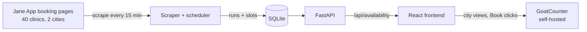

# RMT Finder

Find open RMT (registered massage therapist) appointments across 40 clinics in
Victoria and Langford, BC in one place — scraped every 15 minutes, shown with honest freshness
labels.

**Live:** https://rmtfinder.studiobeckett.ca

<!-- screenshot: add once the site is live over HTTPS

-->

<!-- NOTE: wording throughout assumes Jane App is the only booking platform.
When a second platform lands (Mindbody adapter is already stubbed in
scraper/clinics.py), update: the pitch line, "How it works" diagram + prose,
and the scraping-posture section (robots.txt argument is Jane-specific). -->

## Why

Booking a massage in Victoria means checking two dozen clinic booking sites by
hand, one at a time, most of which show nothing available. Each clinic runs its
own Jane App booking page, and no aggregate view exists. RMT Finder scrapes the
public booking pages on a schedule and answers the only question that matters:
_who has an opening in the next three days?_

## How it works


```mermaid
flowchart LR
    J[Jane App booking pages<br/>40 clinics, 2 cities] -->|"scrape every 15 min"| S[Scraper + scheduler]
    S -->|"runs + slots"| DB[(SQLite)]
    DB --> API[FastAPI]
    API -->|"/api/availability"| FE[React frontend]
    FE -->|"city views, Book clicks"| GC[GoatCounter<br/>self-hosted]
```

A scheduler process runs a scrape cycle every 15 minutes: each clinic's Jane App
page is fetched (with a courtesy delay between clinics), massage-therapy
treatments are matched and filtered, and the resulting slots are written to
SQLite along with a record of the run itself — when it ran, which clinics
succeeded, which failed. A FastAPI service reads the same database and serves
both the JSON API and the built frontend from one origin.

Traffic analytics run on a self-hosted GoatCounter instance on the same server:
cookieless, no personal data, no consent banner. It records two things. **City
views**, one per city actually shown (`/victoria`, `/langford`), sent once the
API answers: a failed load counts as nothing, and tracking parameters never
split a city into extra rows. **Book clicks** per clinic location
(`book/<clinic-slug>`), keyed by a fixed slug so a clinic's history survives a
rename. That one answers the question that matters: which clinics does RMT
Finder actually send people to? The owner's own browsers are opted out, and
local development sends nothing. Empty-results tracking ("Nothing left today")
was deliberately dropped: Today is the default view, so every evening visit
lands on an empty Today, and a quiet day reflects clinic hours, not demand.

## Design decisions

**Serve the last _good_ run, admit the gap.** If the most recent scrape failed
entirely, the API serves the last run that succeeded and reports both
timestamps. The frontend turns that into explicit UI states: a staleness banner
when data is older than two scrape intervals, a quieter notice when some
clinics failed ("2 of 24 clinics couldn't be checked"), and a distinct message
when the latest check failed outright. No state pretends the data is fresher or
more complete than it is.

**One broken clinic can't kill a run.** Each clinic scrape is isolated;
failures are caught, recorded per-clinic in the run history, and the cycle
continues. Clinics change their Jane App configurations without notice, so
partial failure is the normal case to engineer for, not the exception.

**Scraping posture.** Jane App's `robots.txt` explicitly allows general
crawlers on public booking pages (`User-agent: * / Allow: /`). On top of that,
the scraper keeps its footprint small: public pages only, a pause between
clinics, ~one pass per 15 minutes, and a run-history table that would surface
any throttling immediately.

**SQLite on purpose.** One writer (the scheduler), one reader (the API), a few
hundred rows per run — a database server would add operational surface without
buying anything. The storage layer is a single module, so outgrowing SQLite is
a contained change.

## Run it locally

Needs Python 3.10+ and Node 20+. The commands are for **Git Bash on Windows**.
On macOS/Linux, replace `venv/Scripts/` with `venv/bin/`. In bash, use
forward slashes: `venv\Scripts\...` breaks because bash treats `\` as an
escape character.

### First time only

Skip this if `venv/` already exists at the repo root. Start in the repo root
(not `backend/`), or the venv lands in the wrong folder:

```bash
cd /c/code/rmt-finder
```

Create the virtual environment:

```bash
python -m venv venv
```

Install the backend dependencies into it:

```bash
venv/Scripts/python.exe -m pip install -r requirements.txt
```

Create the database tables:

```bash
venv/Scripts/python.exe backend/migrate.py
```

Install the frontend dependencies:

```bash
npm --prefix frontend install
```

### Every time

Run each step in its own terminal. Start every terminal in the repo root:

```bash
cd /c/code/rmt-finder
```

**1. Scrape once** to fill `data/rmt-finder.db` with every city. Takes a few
minutes:

```bash
venv/Scripts/python.exe backend/main.py
```

**2. API**, at http://localhost:8000. Leave it running:

```bash
venv/Scripts/python.exe -m uvicorn api:app --app-dir backend --reload --port 8000
```

**3. Frontend**, at http://localhost:5173. Leave it running:

```bash
npm --prefix frontend run dev
```

Open http://localhost:5173. Add `?city=langford` (or `?city=victoria`) to
link straight to a city.

To keep scraping every 15 minutes instead of once, as production does, run
the scheduler in place of step 1:

```bash
venv/Scripts/python.exe backend/scheduler.py
```

### Tests

Both suites also run in CI on every push.

```bash
venv/Scripts/python.exe -m pytest -q
```

```bash
npm --prefix frontend test
```

## Deployment

Runs on a DigitalOcean droplet: two systemd services (API + scheduler)
sharing the SQLite file, Caddy terminating HTTPS in front of uvicorn, GitHub
Actions running both test suites on every push. Deliberately Docker-free for
v1 — the full reasoning and step-by-step runbook is in
[docs/plans/vertical-slice/07-deployment.md](docs/plans/vertical-slice/07-deployment.md).

## Roadmap

- Nightly SQLite backup off-box
- Dockerize (compose file for the API + scheduler pair)
- Publish each run as a static JSON snapshot to a CDN, decoupling serving
  uptime from the scraper box
- More cities (adding a city is a roster change in `scraper/clinics.py`) and
  more booking platforms (the scraper is adapter-based)
